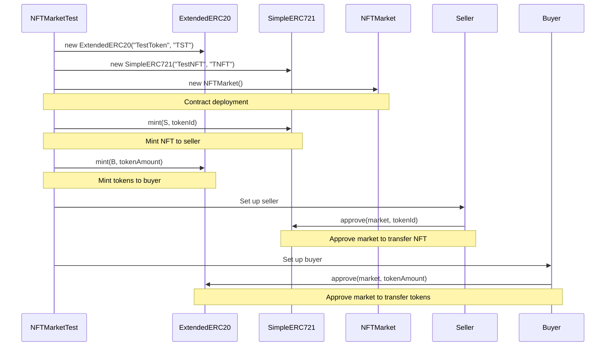
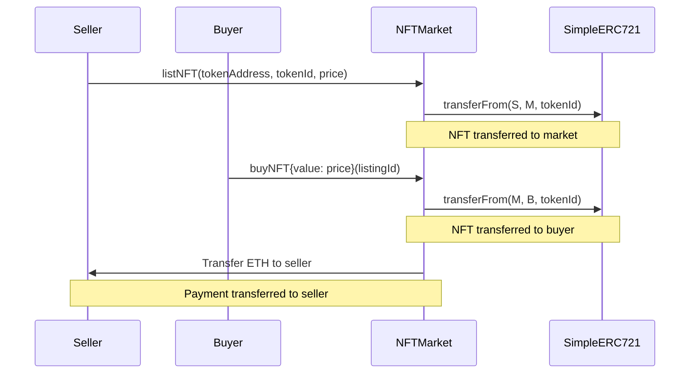
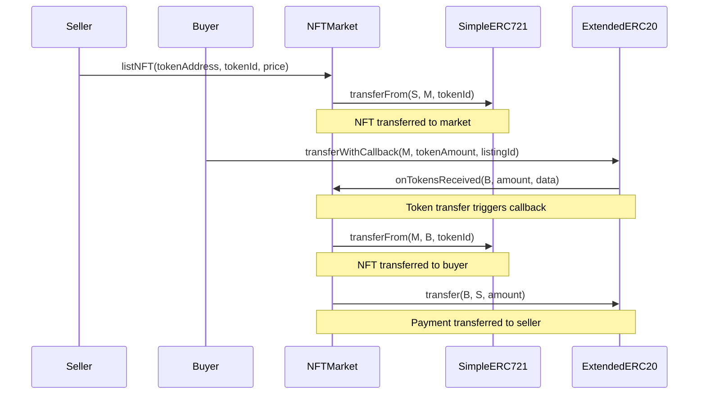
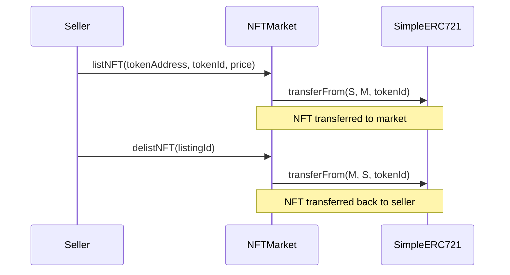

## NFTMarket V1

This project implements a complete NFT marketplace on Ethereum with the following core contracts:

### Core Contracts

1. **SimpleERC721.sol**: A simplified implementation of the ERC721 Non-Fungible Token Standard

2. **ExtendedERC20.sol**: An extended implementation of the ERC20 Fungible Token Standard with callback support

3. **NFTMarket.sol**: The main marketplace contract for listing, buying, and selling NFTs with ETH or ERC20 tokens

4. **ITokenReceiver.sol**: Interface for token receiver callback functionality

### Key Features

- List NFTs for sale with fixed prices
- Buy NFTs with ETH or ERC20 tokens
- Support for token callback mechanisms
- Comprehensive testing with detailed console logs

### Project Structure

```
src/
├── SimpleERC721.sol       # ERC721 NFT implementation
│   └── SimpleERC721       # Main contract implementing ERC721 standard
├── ExtendedERC20.sol      # ERC20 token with callback support
│   └── ExtendedERC20      # Main contract implementing extended ERC20 standard with callback
├── NFTMarket.sol          # Main marketplace contract
│   └── NFTMarket          # Main contract implementing NFT marketplace functionality
├── IERC721.sol            # ERC721 interface
├── IExtendedERC20.sol     # Extended ERC20 interface
├── ITokenReceiver.sol     # Token receiver interface
test/
├── NFTMarket.t.sol        # Test suite for all contracts
```

### Test Setup Sequence

The following diagram shows the sequence of operations in the test setup phase:



### TestBuyNFTWithETH Sequence

The following diagram shows the sequence of operations when buying an NFT with ETH:



### TestBuyNFTWithToken Sequence

The following diagram shows the sequence of operations when buying an NFT with ERC20 tokens:



### TestDelistNFT Sequence

The following diagram shows the sequence of operations when delisting an NFT:



### Deployment with Foundry

To deploy the NFTMarket contract, you can use the provided deployment script:

```bash
# Local dry-run simulation
forge script script/NFTMarket.s.sol:NFTMarketScript --sig "run()"

# Deploy to local testnet (e.g. Anvil)
forge script script/NFTMarket.s.sol:NFTMarketScript --sig "deployToLocalhost()" \
  --rpc-url http://localhost:8545 \
  --private-key YOUR_PRIVATE_KEY

# Deploy to Goerli testnet
forge script script/NFTMarket.s.sol:NFTMarketScript --sig "deployToGoerli()" \
  --rpc-url https://goerli.infura.io/v3/YOUR_INFURA_KEY \
  --private-key YOUR_PRIVATE_KEY
```

### Documentation

For more information about the Foundry development framework used in this project, visit: https://book.getfoundry.sh/