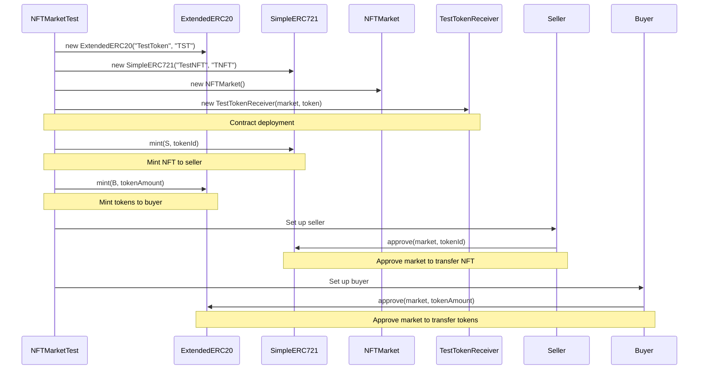
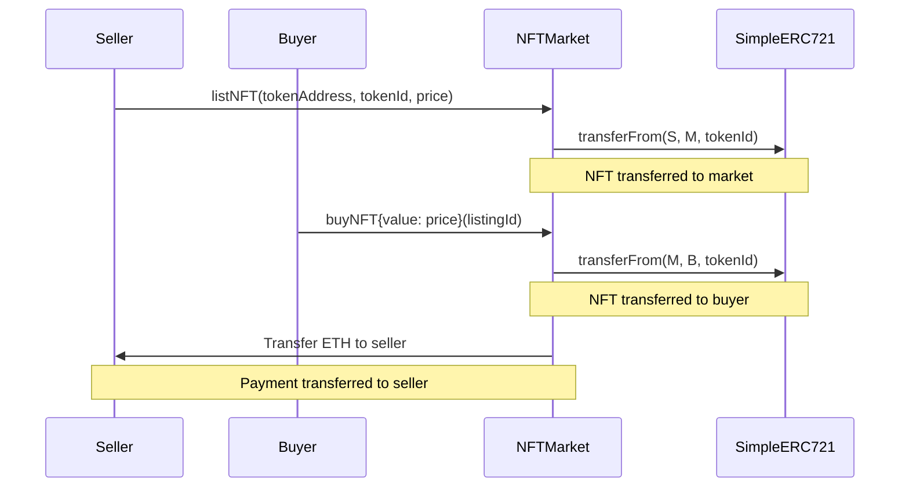
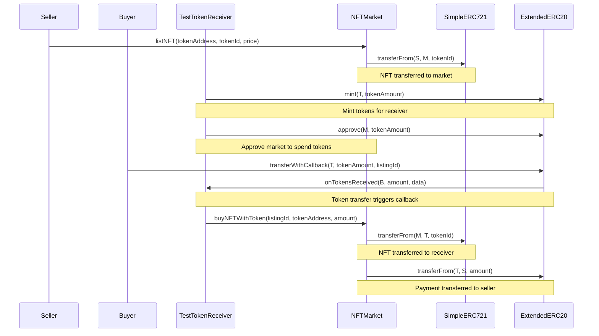
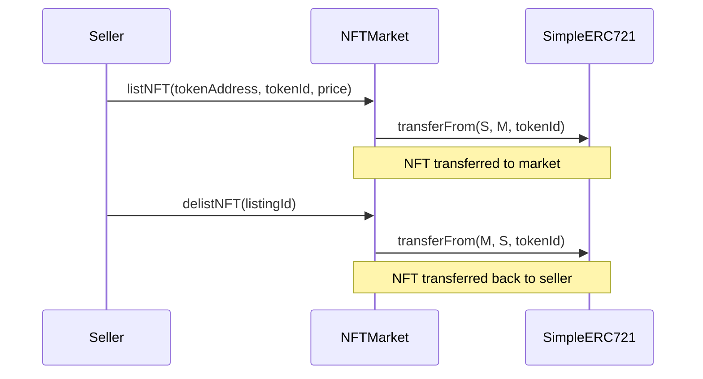

## NFTMarket V1

This project implements a complete NFT marketplace on Ethereum with the following core contracts:

### Core Contracts

1. **SimpleERC721.sol**: A simplified implementation of the ERC721 Non-Fungible Token Standard

2. **ExtendedERC20.sol**: An extended implementation of the ERC20 Fungible Token Standard with callback support

3. **NFTMarket.sol**: The main marketplace contract for listing, buying, and selling NFTs with ETH or ERC20 tokens

### Key Features

- List NFTs for sale with fixed prices
- Buy NFTs with ETH or ERC20 tokens
- Support for token callback mechanisms
- Comprehensive testing with detailed console logs

### Project Structure

```
src/
├── SimpleERC721.sol       # ERC721 NFT implementation
├── ExtendedERC20.sol      # ERC20 token with callback support
├── NFTMarket.sol          # Main marketplace contract
├── IERC721.sol            # ERC721 interface
├── IExtendedERC20.sol     # Extended ERC20 interface
├── ITokenReceiver.sol     # Token receiver interface
test/
├── NFTMarket.t.sol        # Test suite for all contracts
```

### Test Setup Sequence

The following diagram shows the sequence of operations in the test setup phase:



### TestBuyNFTWithETH Sequence

The following diagram shows the sequence of operations when buying an NFT with ETH:



### TestBuyNFTWithToken Sequence

The following diagram shows the sequence of operations when buying an NFT with ERC20 tokens:



### TestDelistNFT Sequence

The following diagram shows the sequence of operations when delisting an NFT:



### Documentation

For more information about the Foundry development framework used in this project, visit: https://book.getfoundry.sh/