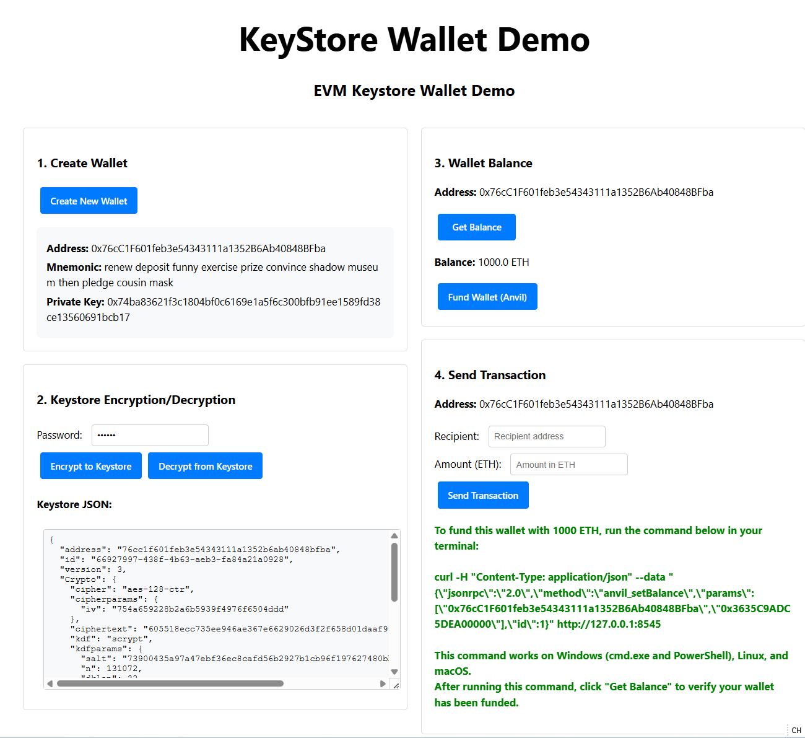
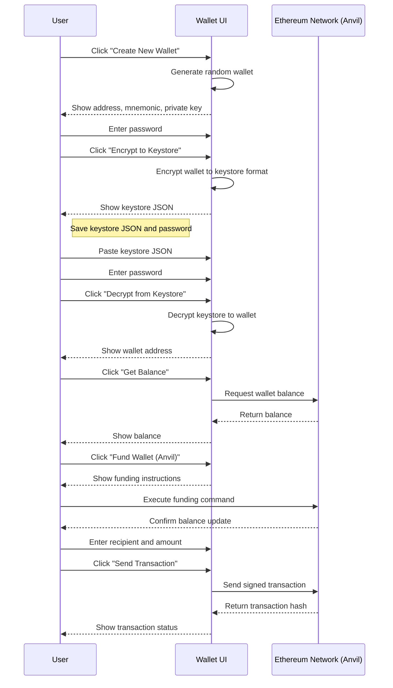

# KeyStore Wallet Demo

A simple EVM keystore wallet demo for educational purposes. This application demonstrates how Ethereum wallets work with keystore files and how to perform transactions on a local Anvil network.

## User Guide

### Creating and Using a Wallet

1. Open the application in your browser (typically http://localhost:5173)
2. Click "Create New Wallet" to generate a new Ethereum wallet
3. Note the generated mnemonic and private key (for educational purposes only)
4. Enter a password and click "Encrypt to Keystore" to create a keystore file
5. Save the keystore JSON and password securely

### Restoring a Wallet from Keystore

1. Paste a valid keystore JSON into the textarea
2. Enter the password used to encrypt the keystore
3. Click "Decrypt from Keystore"
4. The wallet address and other information should appear

### Checking Balance and Sending Transactions

1. After creating or restoring a wallet, the right column will show wallet functions
2. Click "Get Balance" to check the wallet's ETH balance
3. Click "Fund Wallet (Anvil)" to get instructions for funding your wallet on Anvil
4. Enter a recipient address and amount, then click "Send Transaction"

## Keystore Principles

A keystore is an encrypted JSON file that contains a wallet's private key. It's encrypted with a password and is a safer way to store your private keys compared to plain text. The keystore follows the Web3 Secret Storage standard.

The encryption process:
1. A random salt and IV (Initialization Vector) are generated
2. Your password is combined with the salt using a Key Derivation Function (KDF)
3. The private key is encrypted using AES with the derived key and IV
4. A MAC (Message Authentication Code) is computed for verification
5. All data is packaged into the JSON structure

This approach ensures that your private key is never stored in plain text and can only be recovered with the correct password.

## How It Works

Below is a sequence diagram showing the workflow of creating and using a wallet with keystore:

## Troubleshooting

If "Decrypt from Keystore" seems to do nothing:

1. Check the browser console for error messages (F12 Developer Tools)
2. Ensure the keystore JSON is valid and complete
3. Verify the password is correct
4. Make sure you've entered both keystore JSON and password before clicking the button

Common issues:
- Missing or malformed keystore JSON
- Incorrect password
- Incomplete keystore file (must be full JSON, not just a fragment)

## Development

This project is built with:
- React 19
- Vite
- Ethers.js v6
- Vanilla CSS

To modify the code:
1. Edit files in the `src/` directory
2. The main wallet logic is in `src/Wallet.jsx`
3. CSS styles are in `src/index.css`

## Security Warning

This is a demo application for educational purposes only:
- Never use real private keys or seed phrases
- The keystore implementation is for learning, not production use
- Always use secure, audited libraries for real wallet applications
- This application should only be used on local test networks