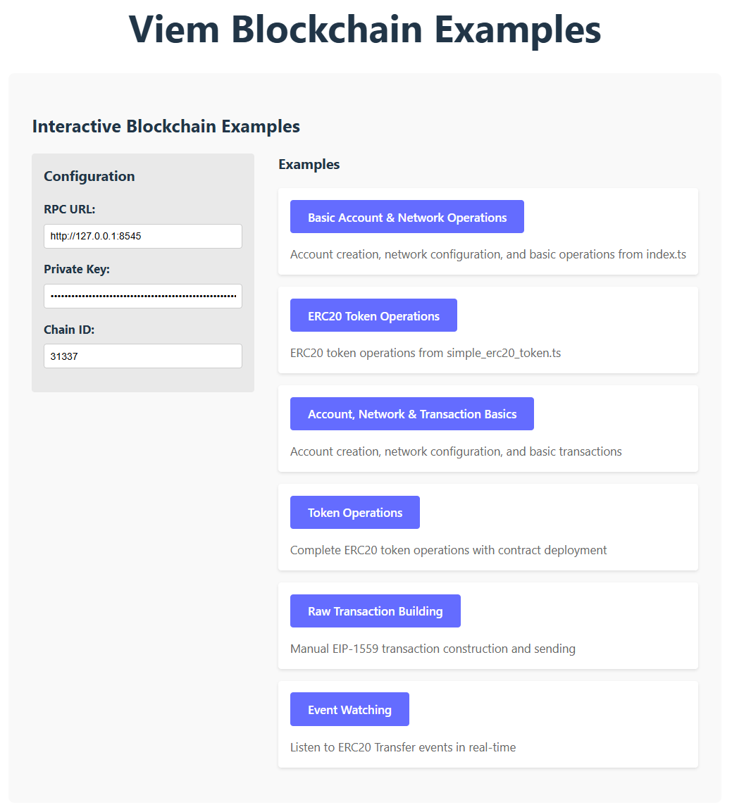

# Viem Blockchain Examples

This project provides a collection of blockchain examples using the [viem](https://viem.sh/) library. It demonstrates various blockchain operations including account management, network configuration, transactions, and smart contract interactions.

## Project Overview

This is a React + TypeScript + Vite application that showcases blockchain development concepts using the viem library. The project includes interactive examples that allow users to experiment with different blockchain operations in a controlled environment.

## Features

- Account creation and management
- Network configuration (Ethereum mainnet, local testnets)
- Basic ETH transactions
- ERC20 token operations (balance queries, transfers, approvals)
- Smart contract interaction
- Event watching
- Raw transaction building and sending

## Prerequisites

- Node.js (v22 or higher)
- pnpm package manager
- Access to an Ethereum RPC endpoint (Alchemy, Infura, or local node like Anvil)

## Installation

```bash
# Clone the repository
git clone <repository-url>

# Install dependencies
pnpm install
```

## Running the Application

```bash
# Start the development server
pnpm run dev
```

The application will be available at `http://localhost:5173` by default.

## User Interface

The application features an interactive web interface that allows you to configure and run different blockchain examples:



The interface is organized into the following sections:

1. **Configuration Area**: Set your RPC URL, Private Key, and Chain ID
2. **Examples List**: Select from different blockchain examples to run
3. **Status Display**: Shows which example is currently running
4. **Console Output**: All example outputs are displayed in the browser's developer console

## User Guide

### Setting up Environment Variables

Before running the examples, you need to configure your environment variables. Create a `.env` file in the project root with the following variables:

```env
VITE_PRIVATE_KEY=your_private_key_here
VITE_ANVIL_RPC_URL=http://127.0.0.1:8545
VITE_ANVIL_CHAIN=31337
```

### Running Examples

The application provides several interactive examples:

1. **Account, Network & Transaction Basics**:
   - Demonstrates account creation
   - Shows network configuration
   - Performs basic ETH transactions with balance tracking

2. **Raw Transaction Building**:
   - Builds and sends EIP-1559 transactions
   - Shows manual transaction construction
   - Displays detailed transaction information

3. **ERC20 Token Operations**:
   - Queries ERC20 token balances
   - Transfers tokens between accounts with detailed balance tracking
   - Manages token approvals for spending with proper allowance handling

4. **Watch Transfer Events**:
   - Listens to smart contract events in real-time
   - Demonstrates event filtering and handling
   - Shows how to process Transfer events from ERC20 tokens

5. **Simple ERC20 Token**:
   - Demonstrates custom ERC20 token operations
   - Shows token balance queries, transfers, and approvals
   - Provides detailed logging of token operations

### Using the Interface

1. Start the development server with `pnpm run dev`
2. Open your browser to `http://localhost:5173`
3. Configure your RPC URL, Private Key, and Chain ID in the interface
4. Select an example to run from the list
5. Check the browser console for detailed output and results

### Events Listener

If you are using foundry and anvil, you can use this command to trigger events:

Emit transfer event:
```bash
cast send $TOKEN_ADDRESS \
  "transfer(address,uint256)" $RECIPIENT_ADDRESS $AMOUNT \
  --private-key $SPENDER_PRIVATE_KEY \
  --rpc-url http://localhost:8545
```

Demo like this:
```bash
cast send 0x8464135c8f25da09e49bc8782676a84730c318bc "transfer(address,uint256)" 0x976EA74026E726554dB657fA54763abd0C3a0aa9 11 --private-key 0x59c6995e998f97a5a0044966f0945389dc9e86dae88c7a8412f4603b6b78690d --rpc-url http://localhost:8545
```

### Example Outputs

Each example provides detailed console output including:
- Account addresses
- Network information
- Transaction hashes
- Balance changes
- Transaction confirmations
- Error handling

## Development

### Building for Production

```bash
# Create a production build
pnpm run build
```

### Previewing Production Build

```bash
# Preview the production build locally
pnpm run preview
```

### Linting

```bash
# Run ESLint
pnpm run lint
```

## Project Structure

```
src/
├── examples/                    # Blockchain example implementations
│   ├── account_net_tx_basics.ts # Account, network, and basic transaction operations
│   ├── build_raw_tx.ts          # Raw transaction building and sending
│   ├── simple_erc20_token.ts    # Simple ERC20 token operations
│   ├── token_basics.ts          # ERC20 token operations with detailed balance tracking
│   ├── watchTransfer.ts         # Event watching for Transfer events
│   └── index.ts                 # Example exports and coordination
├── App.tsx                      # Main application component
├── main.tsx                     # Application entry point
└── vite-env.d.ts                # Type definitions
```

## Smart Contracts

The project includes a simple `SimpleToken.sol` contract for testing token operations.

To deploy the contract to a local Anvil instance:

1. Start Anvil: `anvil`
2. Deploy the contract: `forge script script/Deploy.s.sol --rpc-url http://127.0.0.1:8545 --private-key YOUR_PRIVATE_KEY`

## Troubleshooting

### Common Issues

1. **RPC Connection Errors**:
   - Ensure your RPC URL is correct and accessible
   - Check that your local node (if using Anvil) is running
   - Verify your API key if using Alchemy/Infura

2. **Nonce Errors**:
   - These typically resolve automatically as transactions are confirmed
   - Ensure you're not sending duplicate transactions

3. **Insufficient Funds**:
   - Check that your account has enough ETH for gas fees
   - For local testing with Anvil, the default accounts are pre-funded

### Getting Help

For issues with the examples or viem library, refer to:
- [Viem Documentation](https://viem.sh/)
- [Ethereum Documentation](https://ethereum.org/developers/)