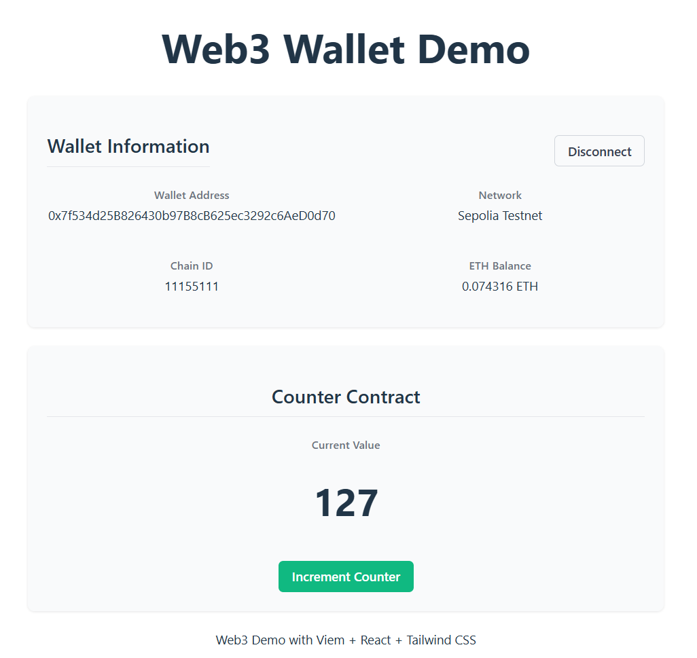

# Viem Web3 Demo Project

This is a simple Web3 demo project implemented with Viem, demonstrating how to connect to MetaMask wallet and display wallet information.

## UI Preview

### Default Page


### Wallet Connected Page


## Features

- Connect to MetaMask wallet
- Display wallet address
- Display current network information (network name and Chain ID)
- Display wallet ETH balance
- Support wallet disconnection
- Call Counter contract's increment method
- Display current value of Counter contract

## Development Environment Requirements

- Node.js
- pnpm package manager
- MetaMask wallet extension
- Foundry development environment (optional)

## Tech Stack

- React
- VITE
- Viem
- Tailwind CSS
- TypeScript

## Installation and Running

1. Clone the project locally
2. Install dependencies:
   ```
   pnpm install
   ```
3. Start the development server:
   ```
   pnpm dev
   ```

## Usage

1. Make sure you have installed the MetaMask browser extension
2. Open the application in your browser
3. Click the "Connect MetaMask Wallet" button
4. Authorize and connect your wallet account
5. View the displayed wallet information and contract data
6. You can interact with the Counter contract through the "Increment" button

## Deployment Guide - Sepolia Testnet

To deploy the [Demo-Contract.sol](file:///d%3A/code/web3/decert_me/front/viem-front/docs/Demo-Contract.sol) contract to the Sepolia testnet using Remix and MetaMask:

1. Open [Remix IDE](https://remix.ethereum.org/)
2. Create a new file and copy the content from [docs/Demo-Contract.sol](file:///d%3A/code/web3/decert_me/front/viem-front/docs/Demo-Contract.sol)
3. Compile the contract:
   - Select the Solidity compiler (version 0.8.13 or higher)
   - Click "Compile Demo-Contract.sol"
4. Deploy the contract:
   - Go to the "Deploy & Run Transactions" tab
   - Select "Injected Provider - MetaMask" as the environment
   - Make sure MetaMask is connected to the Sepolia testnet
   - Click "Deploy"
5. Confirm the deployment in MetaMask
6. After successful deployment, you'll see the contract address in the "Deployed Contracts" section
7. Copy this address and update it in your frontend code (in [src/App.tsx](file:///d%3A/code/web3/decert_me/front/viem-front/src/App.tsx))

## Notes

- Counter contract address needs to be configured in the code
- Currently defaults to connecting to Sepolia testnet, can be modified as needed
- Requires browser support and MetaMask extension to be installed

## Project Structure

```
src/
├── App.tsx          # Main React component
├── main.tsx         # Application entry file
├── index.css        # Global style file, including Tailwind CSS directives
├── vite-env.d.ts    # TypeScript type declaration file
└── assets/          # Static resource files
```

## Function Details

### Wallet Connection
Use Viem's `createWalletClient` and `custom` transport to create a wallet client, interacting with MetaMask through `window.ethereum`.

### Network Information
Get information about the currently connected network, including network name and Chain ID.

### Balance Query
Use Viem's `getBalance` method to query the account's ETH balance and format it with `formatEther` for display.

### Contract Interaction
Create a contract instance through Viem's `getContract` method to implement reading contract data and sending transactions.

## Development Guide

1. Modify contract address: Replace `counterContractAddress` in App.tsx with the actual contract address
2. Modify network configuration: You can change the default connected network in the code
3. Add new features: You can extend more Web3 features based on existing code

## Useful Resources

- [React Documentation](https://react.dev)
- [Viem Documentation](https://viem.sh)
- [Remix IDE](https://remix.ethereum.org)