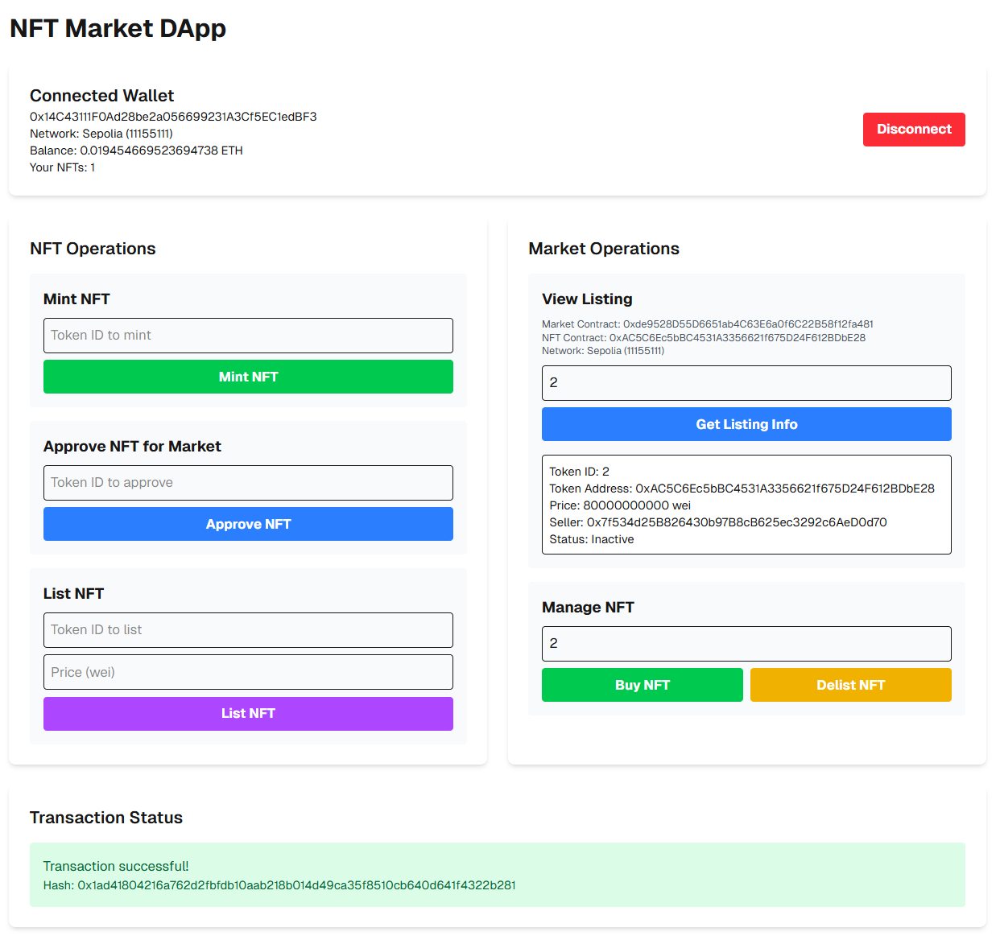

# NFT Market DApp

This is a [Next.js](https://nextjs.org) project bootstrapped with [`create-next-app`](https://nextjs.org/docs/app/api-reference/cli/create-next-app). It's a decentralized NFT marketplace application built with Web3 technologies that allows users to mint, list, buy, and delist NFTs.

## Project Introduction

This NFT Market DApp is a full-featured decentralized application that demonstrates the core functionality of an NFT marketplace. Built with modern web technologies, it provides an intuitive interface for users to interact with smart contracts on the Ethereum blockchain.



### Key Features

- Wallet connection via MetaMask or other Web3 wallets
- NFT minting with custom token ID
- NFT listing with configurable prices
- NFT purchasing functionality
- NFT delisting for sellers
- Real-time transaction status updates
- Support for Sepolia testnet and local Anvil network development
- Responsive two-column layout for optimal user experience

### Technology Stack

- [Next.js](https://nextjs.org/) v15.5.0 - React framework with App Router
- [Wagmi](https://wagmi.sh/) v2 - React hooks for Ethereum
- [Viem](https://viem.sh/) - TypeScript interface for Ethereum
- [Tailwind CSS](https://tailwindcss.com/) v4 - Utility-first CSS framework
- [TypeScript](https://www.typescriptlang.org/) - Typed JavaScript
- [React](https://reactjs.org/) v19.1.0

## User Guide

### Getting Started

1. Make sure you have MetaMask or another Web3 wallet installed in your browser
2. Connect to Sepolia testnet or a local Anvil network
3. Run the development server (see Developer Guide below)

### Using the Application

#### Connecting Your Wallet

1. Click the "Connect Wallet" button on the homepage
2. Select your preferred wallet provider (e.g., MetaMask)
3. Confirm the connection in your wallet

#### Minting an NFT

1. Enter the Token ID you want to mint
2. Click "Mint NFT" button
3. Confirm the transaction in your wallet
4. Your new NFT with the specified Token ID will appear in your wallet

#### Listing an NFT for Sale

1. Note the Token ID of the NFT you want to sell
2. In the "Approve NFT for Market" section:
   - Enter the Token ID
   - Click "Approve NFT"
   - Confirm in your wallet
3. In the "List NFT" section:
   - Enter the Token ID
   - Set a price in wei
   - Click "List NFT"
   - Confirm in your wallet

#### Buying an NFT

1. Find the Listing ID of the NFT you want to buy
2. In the "View Listing" section:
   - Enter the Listing ID
   - Click "Get Listing Info" to verify details
3. In the "Manage NFT" section:
   - Enter the Listing ID
   - Click "Buy NFT"
   - Confirm the transaction with the required ETH amount

#### Delisting an NFT

If you change your mind about selling an NFT:
1. In the "Manage NFT" section:
   - Enter the Listing ID
   - Click "Delist NFT"
   - Confirm in your wallet

### Interface Overview

The application features a responsive two-column layout for optimal user experience:
- Left column: NFT creation and listing operations
- Right column: Market viewing and purchasing operations
- All critical information visible without scrolling on most screens

## Developer Guide

### Prerequisites

- Node.js (v18 or higher recommended)
- npm, yarn, pnpm, or bun
- An Ethereum development environment (like Foundry with Anvil)

### Setting up the Development Environment

1. Clone the repository:
   ```bash
   git clone <repository-url>
   ```

2. Install dependencies:
   ```bash
   npm install
   # or
   yarn install
   # or
   pnpm install
   # or
   bun install
   ```

3. Start a local Ethereum network (using Anvil):
   ```bash
   anvil
   ```

4. Deploy the required smart contracts (NFT and Market contracts) to your local network

5. Update the contract addresses in `src/app/page.tsx`:
   ```typescript
   const NFT_MARKET_ADDRESS = 'your_deployed_market_contract_address';
   const NFT_ADDRESS = 'your_deployed_nft_contract_address';
   ```

### Running the Development Server

```bash
npm run dev
# or
yarn dev
# or
pnpm dev
# or
bun dev
```

Open [http://localhost:3000](http://localhost:3000) with your browser to see the result.

The page auto-updates as you edit the file. You can start editing the page by modifying `app/page.tsx`.

### Building for Production

```bash
npm run build
# or
yarn build
# or
pnpm build
# or
bun build
```

### Running in Production Mode

```bash
npm run start
# or
yarn start
# or
pnpm start
# or
bun start
```

### Project Structure

```
src/
├── app/
│   ├── page.tsx          # Main application page
│   ├── layout.tsx        # Root layout with Wagmi providers
│   ├── wagmi.ts          # Wagmi configuration
│   ├── providers.tsx     # Wagmi and React Query providers
│   ├── NFTMarketABI.ts   # NFT Market contract ABI
│   └── NFTABI.ts         # NFT contract ABI
├── app/globals.css       # Global CSS styles
└── public/               # Static assets
```

### Smart Contract Integration

This DApp is designed to work with standard ERC721 NFT contracts and custom NFT market contracts. The ABIs provided in the `src/app/` directory define the interface for interacting with these contracts.

The NFT contract uses a simple [mint](file:///d:/code/web3/decert_me/front/wagmi-front/src/app/NFTABI.ts#L124-L135) function that accepts a recipient address and a token ID. This is a simplified version for demonstration purposes.

### RPC Configuration

If you encounter connection issues with the default Sepolia RPC endpoint, consider using a dedicated provider:

1. **Infura** (recommended):
   - Register for an account at [Infura](https://infura.io/)
   - Create a new project and get your project ID
   - Update the Wagmi configuration in `src/app/wagmi.ts`:
     ```typescript
     [sepolia.id]: http(`https://sepolia.infura.io/v3/YOUR_INFURA_PROJECT_ID`),
     ```

2. **Alchemy**:
   - Register for an account at [Alchemy](https://alchemy.com/)
   - Create a new app and get your API key
   - Update the Wagmi configuration in `src/app/wagmi.ts`:
     ```typescript
     [sepolia.id]: http('https://eth-sepolia.g.alchemy.com/v2/YOUR_ALCHEMY_API_KEY'),
     ```

### Learn More

To learn more about the technologies used in this project:

- [Next.js Documentation](https://nextjs.org/docs) - learn about Next.js features and API
- [Wagmi Documentation](https://wagmi.sh/) - React hooks for Ethereum
- [Viem Documentation](https://viem.sh/) - TypeScript interface for Ethereum
- [Learn Next.js](https://nextjs.org/learn) - an interactive Next.js tutorial

You can check out [the Next.js GitHub repository](https://github.com/vercel/next.js) - your feedback and contributions are welcome!

### Deploy on Vercel

The easiest way to deploy your Next.js app is to use the [Vercel Platform](https://vercel.com/new?utm_medium=default-template&filter=next.js&utm_source=create-next-app&utm_campaign=create-next-app-readme) from the creators of Next.js.

Check out our [Next.js deployment documentation](https://nextjs.org/docs/app/building-your-application/deploying) for more details.